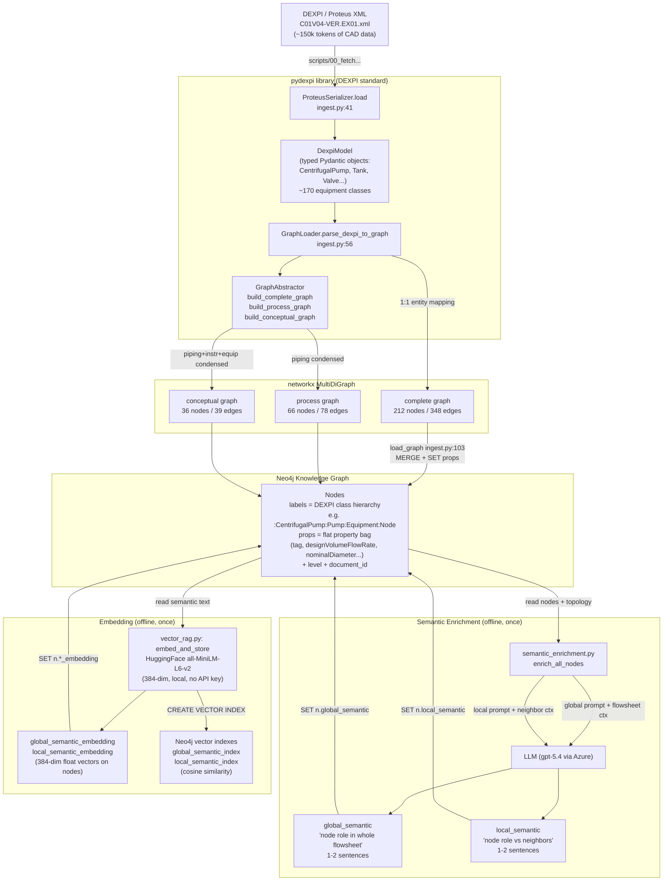
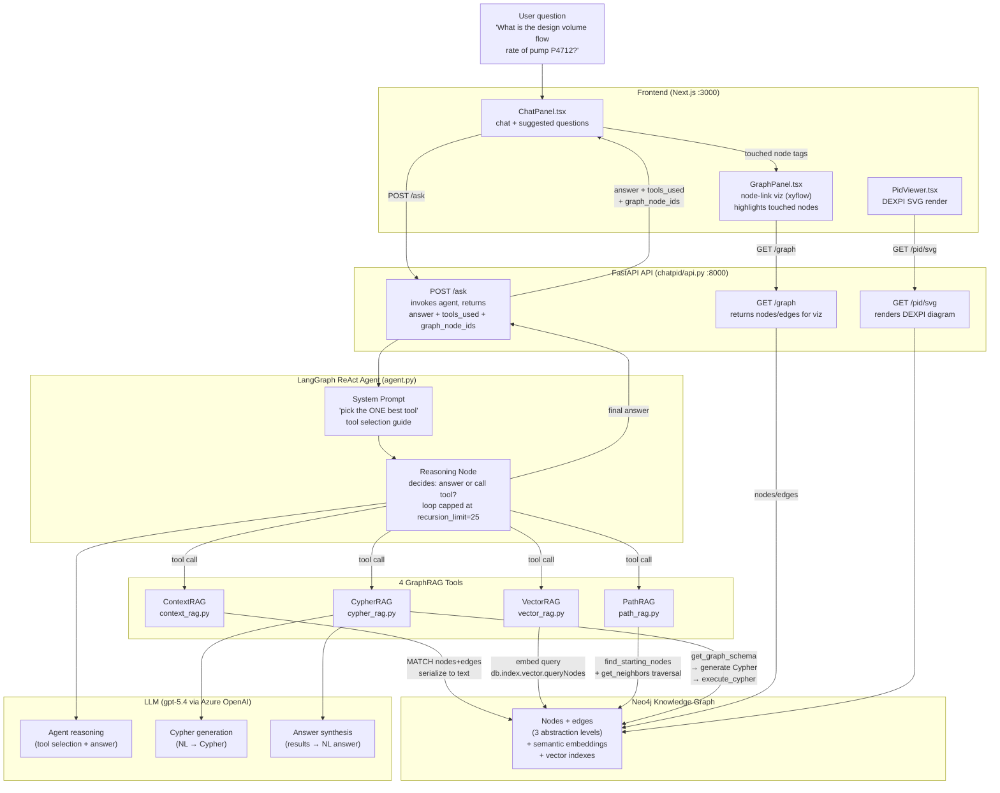
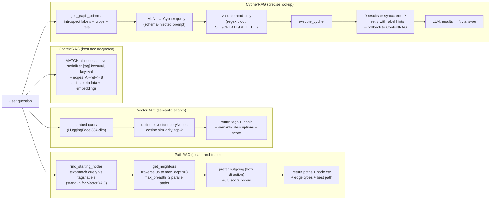

# ChatP&ID — Dataflow Diagram

Two phases: **offline ingestion/enrichment** (builds the knowledge graph) and
**online query** (the ReAct agent answers questions via 4 GraphRAG tools).

## Phase 1 — Offline: Ingestion & Enrichment

## Phase 2 — Online: Query via ReAct Agent

## Tool Detail — How Each GraphRAG Tool Retrieves Data

## Key Data Transformations

| Stage | Input | Output | Where |
|---|---|---|---|
| XML → pydexpi model | Proteus XML (~150k tokens) | Typed Pydantic objects (DEXPI classes) | `ProteusSerializer.load` |
| pydexpi model → networkx | Typed objects | Labeled-property graph (labels string + attr dict) | `GraphLoader.parse_dexpi_to_graph` |
| networkx → 3 abstractions | Complete graph | complete / process / conceptual graphs | `GraphAbstractor.build_*` |
| networkx → Neo4j | Graph nodes/edges | Neo4j nodes with multi-labels + flat props + level | `load_graph` (ingest.py:103) |
| Neo4j → semantic text | Node + topology | global_semantic + local_semantic (1-2 sentences each) | `enrich_all_nodes` (LLM) |
| Semantic text → vectors | Text descriptions | 384-dim float embeddings on nodes | `embed_and_store` (HuggingFace) |
| Question → answer | NL question | Grounded NL answer + tool trace + touched nodes | ReAct agent + 1 of 4 tools |

